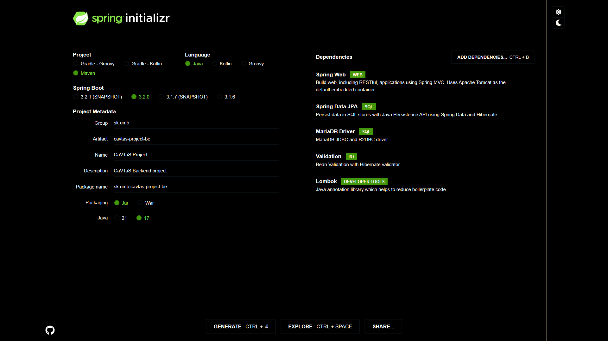

# Postup práce

## Úplný začiatok

Vytvoril som si nový Github repozitár 'CaVTaS', ktorý som si následne naklonoval do počítača pomocou príkazu `git clone https://github.com/Voltrifrodec/CaVTaS.git`.

Následne som vytvoril README a CHANGELOG súbory a zadefinoval ciele.


## Začiatok - Backend

Pomocou [https://start.spring.io/](https://start.spring.io/) som si vytvoril nový Spring Boot projekt s názvom **cavtas-be**. Pridal som nasledujúce dependencies:

1. Spring Web
2. Spring Data JPA
3. MariaDB Driver
4. Validation
5. Lombok

Dependencies ako security alebo Swagger UI som pre zatiaľ nepridával. Konfigurácia vypadá nasledovne:



Následne som už len dal vygenerovať projekt a rozbalil.
Ako prvú vec som upravil verziu Spring Boot na 3.0.5 a pridal `<project.build.sourceEncoding>UTF-8</project.build.sourceEncoding>` do `<properties>` v `pom.xml`. Ďalej som si vytvoril `docker-compose.yml` súbor do ktorého som pridal setup pre databázu.
Nastavil som požadované atribúty v `application.properties`:

```properties
spring.datasource.url=jdbc:mariadb://localhost:3306/cavtas
spring.datasource.username=root
spring.datasource.password=root
spring.datasource.driver-class-name=org.mariadb.jdbc.Driver

spring.jpa.hibernate.ddl-auto=update
spring.jpa.properties.hibernate.dialect=org.hibernate.dialect.MariaDBDialect
spring.jpa.open-in-view=false
```


## Začiatok - Frontend

Vytvoril som nový Angular projekt pomocou príkazu `ng new cavtas-fe`. Nastavil som app routing, a SCSS štýly.


<details close>
    <summary>
        <h2>IDE Style</h2>
    </summary>
    <style>
        h1, h2 {
            color: #FFFFFF !important;
        }
        body {
            background: #000000 !important;
            color: #FFFFFF !important;
        }
        code, pre {
            background: #222222 !important;
            color: #DDDDDD !important;
        }
        a {
            color: #00FFFF !important;
            text-decoration: underline !important;
            transition: color .2s ease-in-out;
        }
        a:hover {
            color: #00CCCC !important;
        }
        /* Summary style */
        summary > h2 {
            display: inline-block;
            padding: 0 !important;
            margin: 0 !important;
            font-size: 16px !important;
            vertical-align: middle;
        }
    </style>
</details>